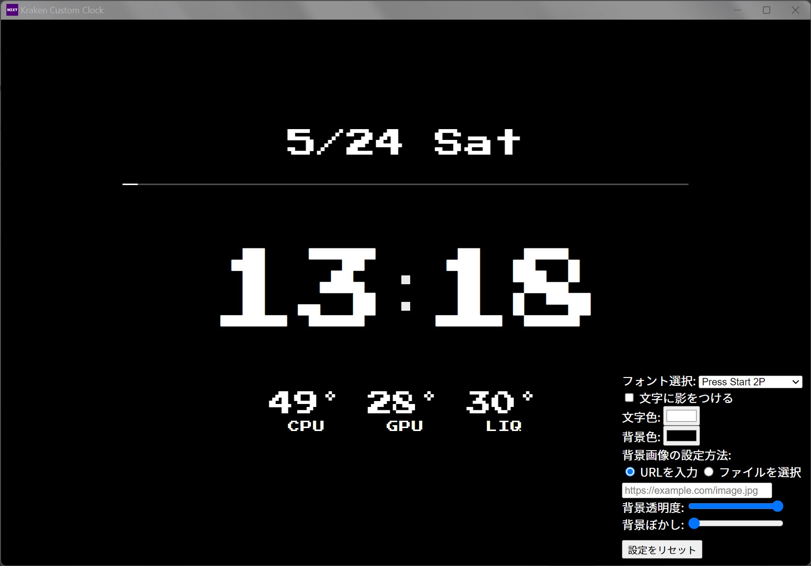
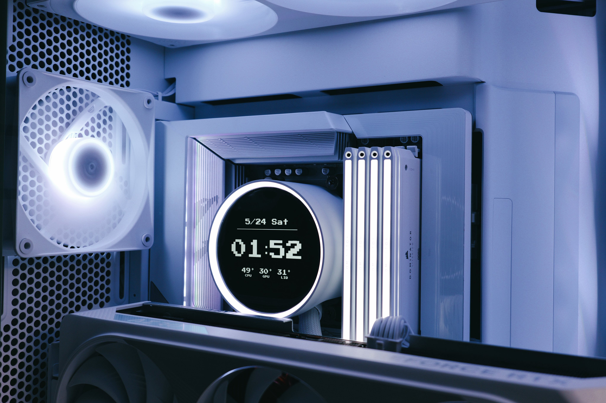

# Kraken Custom Web Integration UI

NZXT Kraken Elite 用に作成した、カスタム時計＆モニタリングUIです。  
NZXT CAM の Web Integration 機能を使って、自由な表示が可能です。

※他Krakenシリーズは動作未確認です。

## 🔧 機能一覧

- デジタル時計（時・分、点滅するコロン）
- 日付表示（例：5/24 Fri）
- CPU / GPU / 冷却水温のリアルタイム表示
- 背景画像・背景色の切り替え（透過・ぼかし対応）
- フォント切り替え（Press Start 2P / Montserrat / Doto / Major Mono Display）
- 秒数に連動するシークバー（秒針）
- 文字色のカスタマイズ
- テキストシャドウ（ON/OFF）
- 各種設定を保存・即時反映
- 設定初期化ボタンつき

## 🌐 GitHub Pages

CAMのWeb Integrationに以下URLを登録することで、Kraken上に表示できます：
https://meteor-oo0.github.io/Meteor-Simple-Clock/

また、こちらをクリックすることで即時に使用することができます。
nzxt-cam://action/load-web-integration?url=https://meteor-oo0.github.io/Meteor-Simple-Clock/

## 💻 使用方法

1. CAMの設定から「Web Integration」を有効化
2. 上記URLをCAMに登録
3. 表示が反映されます
4. CAM上で表示を右クリック → `Configure` からカスタマイズできます

### 🚀 CAMにすぐ適用したい方へ！

👉 [ここをクリックしてCAMに読み込む](https://cam-redirect.nzxt.com/action/load-web-integration?url=https://meteor-oo0.github.io/Meteor-Simple-Clock/)

## 📷 スクリーンショット

### 🎛️ 設定画面（CAM 上）

### 🧊 Kraken Elite 実機での表示例

## 🧠 開発サポート

このプロジェクトは [ChatGPT (OpenAI)] (https://chat.openai.com) を活用して開発しました。  
UI設計、JavaScript構築、エラー修正、GitHub公開設定まで幅広く支援を受けています。

## 📜 ライセンス

MIT License（自由に改変・再配布可）

## 🔗 SNS & Contact

