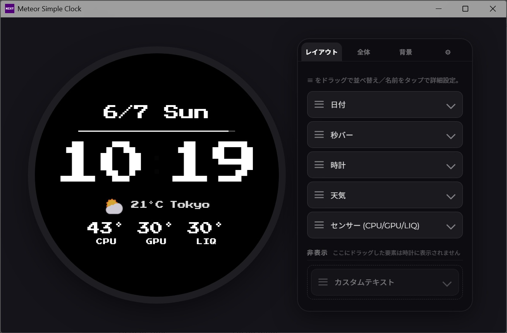
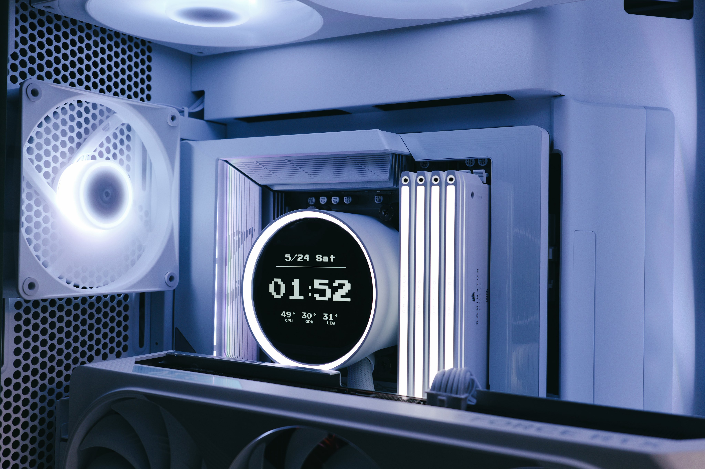

# Meteor Simple Clock v2

NZXT Kraken 用カスタム時計 & モニタリング UI です。  
NZXT CAM の Web Integration 機能を使って、Kraken の LCD に自由なデザインの時計を表示できます。

> **v2** では表示デザインの自由度が大幅に向上しました。ブレンドモード、背景オーバーレイ、個別スタイル設定、プリセット、設定ファイルの保存・読込みなど多数の新機能を追加しています。

---

## 対応機種

| モデル | 対応状況 |
|--------|----------|
| Kraken Elite（円形 LCD） | ✅ 対応（メイン開発機） |
| Kraken（無印・正方形 LCD） | ✅ 対応（v2 より正式対応） |
| Kraken Plus など他シリーズ | ⚠️ 文字スケールを調整することで暫定対応 |

---

## 🌐 GitHub Pages

CAM の Web Integration に以下の URL を登録するだけで Kraken 上に表示できます：

```
https://meteor-oo0.github.io/Meteor-Simple-Clock/
```

### 🚀 CAM にすぐ適用したい方へ

👉 [ここをクリックして CAM に読み込む](https://cam-redirect.nzxt.com/action/load-web-integration?url=https://meteor-oo0.github.io/Meteor-Simple-Clock/)

---

## 💻 使用方法

1. CAM の設定から「Web Integration」を有効化
2. 上記 URL を CAM に登録
3. 表示が反映されます
4. CAM 上で表示を右クリック → `Configure` からカスタマイズできます

---

## 🔧 機能一覧

### 時計・日付
- デジタル時計（時・分、点滅コロン、12/24H 切り替え）
- 秒数表示（数字）のオン/オフ
- コロンの形を四角・丸に切り替え
- 日付表示（複数フォーマット切替、非表示可）

### 秒バー & 秒リング
- 秒バー（シークバー）：伸縮/常時表示、長さ・色・ブレンドモード調整
- 秒リング：円形 LCD の縁を周回する秒針。スタイル（塗りつぶし/ドット周回）、グラデーション、ブレンドモードに対応

### センサー表示
- CPU / GPU 温度、冷却水温（LIQ）
- CPU / GPU 負荷（%）
- CPU / GPU ファン回転数
- メモリ使用量 / 使用率
- 最大 3 つまで同時表示。ドラッグで並べ替え・表示/非表示切り替え可

### 天気
- 都市名で天気を取得（℃ / ℉ 切り替え）
- 気温・天気アイコン・都市名を表示

### カスタムテキスト
- 好きな文字を自由に配置

### デザイン・スタイル
- フォント 10 種から選択
- フォントウェイト（Light / Normal / Bold / Black）
- 文字色・文字スケール・テキストシャドウ
- **ブレンドモード**（通常/乗算/スクリーン/オーバーレイ/差の絶対値など 11 種）  
  全体一括 + 各ブロック個別指定に対応
- **各ブロック個別スタイル**：ブロックごとにフォント・太さ・色・ブレンドを独立設定可

### 背景
- 背景色・透明度・ぼかし
- **背景画像**：正方形クロップ UI（ドラッグ＋ズームで位置調整）  
  GIF アニメーション対応（アニメーションを保持したまま表示位置を調整）
- **背景オーバーレイ効果** 6 種（スキャンライン / CRT / グリッド / ドット / ノイズ / ビネット）  
  強さスライダーで濃さを調整可

### レイアウト
- ブロックの並べ替え（ドラッグ）・表示/非表示
- 各ブロックのサイズ・上下余白を個別調整
- レイアウト変更時のアニメーション（プレビュー時）

### プリセット & バックアップ
- **組み込みプリセット 5 種**（Minimal / Retro / Neon / Aqua / Mono）ワンタップで適用
- **設定のエクスポート/インポート**：全設定 + 背景画像を JSON ファイルで保存・復元
- 設定リセット

---

## 📷 スクリーンショット

### 🎛️ 設定画面（CAM 上）



### 🧊 Kraken Elite 実機での表示例



---

## 🧠 開発サポート

このプロジェクトは [Claude (Anthropic)](https://claude.ai) を活用して開発しました。  
UI 設計、JavaScript 構築、CSS スタイリング、デバッグ、GitHub 公開設定まで幅広く支援を受けています。

---

## 📘 更新履歴 / Changelog

### v2.0.0（2026-06-06）

デザイン自由度と機能を大幅強化した大規模アップデート。

- **秒リング**追加（ドット周回 / 塗りつぶし、グラデーション、ブレンドモード対応）
- **ブレンドモード**追加（文字・リングを背景画像と合成、11 種類、ブロック個別指定も可）
- **背景オーバーレイ効果** 6 種追加（スキャンライン / CRT / グリッド / ドット / ノイズ / ビネット）
- **背景画像クロップ UI** — ドラッグ＋ズームで正方形に切り取り、GIF アニメーション対応
- **天気 / カスタムテキスト**ブロック追加
- **センサー拡充** — CPU / GPU 負荷、ファン回転数、メモリ使用量 / 使用率を追加
- **各ブロック個別スタイル** — ブロックごとにフォント・太さ・色・ブレンドを設定可
- **プリセット 5 種**追加（Minimal / Retro / Neon / Aqua / Mono）
- **設定のエクスポート / インポート** — 全設定＋背景画像を JSON ファイルで保存・復元
- **無印 Kraken（正方形 LCD）正式対応**
- **設定 UI を大幅リニューアル** — タブ構成の整理、アコーディオン式詳細設定、独自デザインのモーダル・トースト通知

---

### v1.3.1（2025-09-17）
- 日付が 2 行になる場合がある問題を修正
- CPU / GPU / LIQ の非表示をそれぞれ個別に設定可能に

### v1.3.0（2025-09-09）
- フォント追加＆フォントウェイト選択
- 日付フォーマット複数選択対応
- 日付の非表示設定を追加
- 秒バー・区切り線の非表示オプション追加
- コロンの形を四角 / 丸に切り替え可能に

### v1.2.0（2025-08-12）
- 12/24H 表示切り替え対応
- CPU / GPU / 冷却水温の非表示対応
- 設定 UI 調整

### v1.1.0（2025-05-25）
- Kraken の解像度に応じた自動調整
- Orbitron, Roboto フォント追加
- 背景画像削除ボタン追加

### v1.0.0（2025-05-24）
- 初回リリース

---

## 📜 ライセンス

MIT License（自由に改変・再配布可）

---

## 🔗 SNS & Contact

[](https://x.com/MeteoR_oo0)
[](https://www.youtube.com/@MeteoR_oo0)
